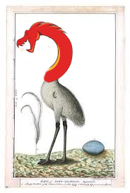

# ghidra-emu-fun
Ghidra Emulates Functions

This repo hosts a Ghidra script that offers a frontend for Ghidra P-code emulator.

The mission of this project is making the emulation of a function as fun as possible.

